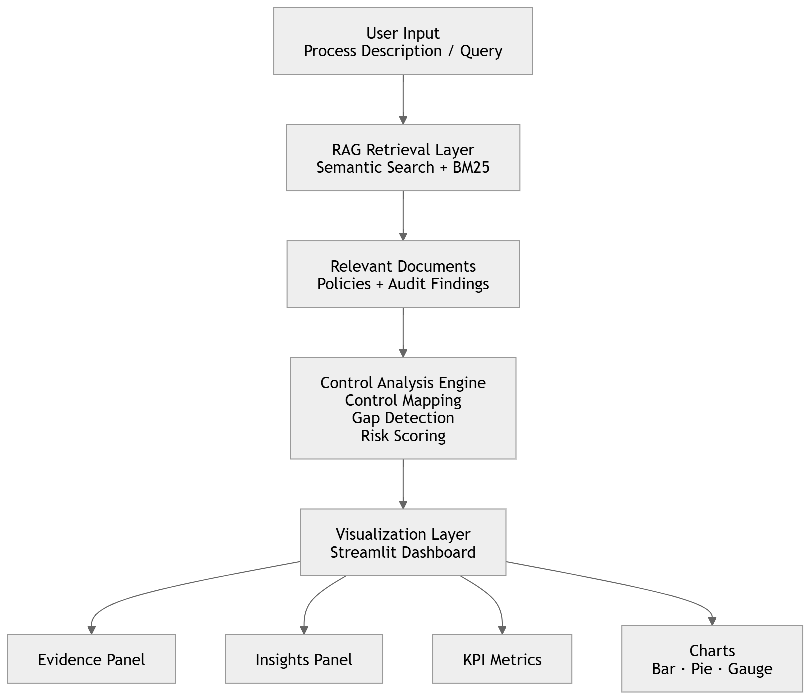
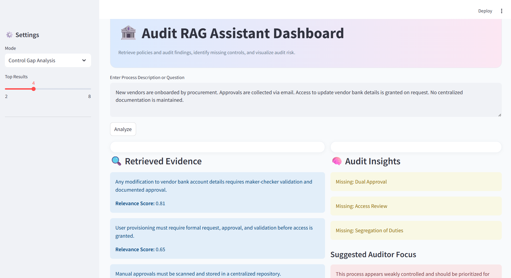
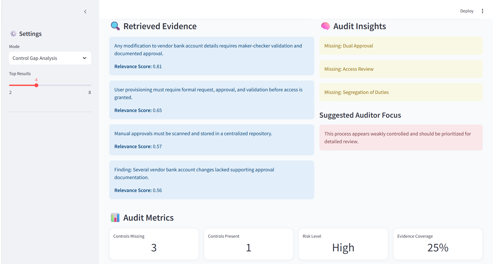
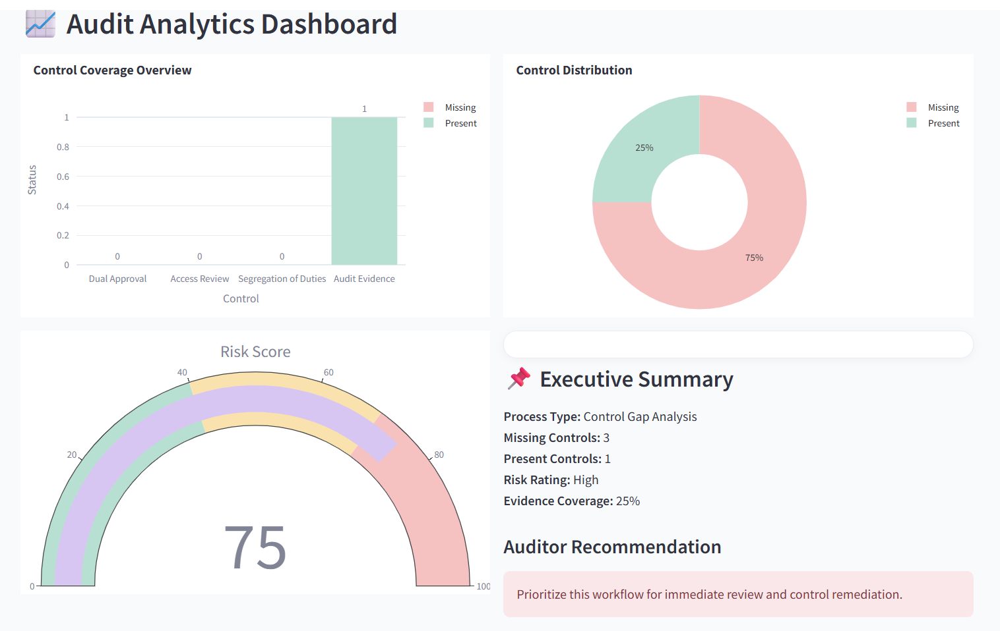
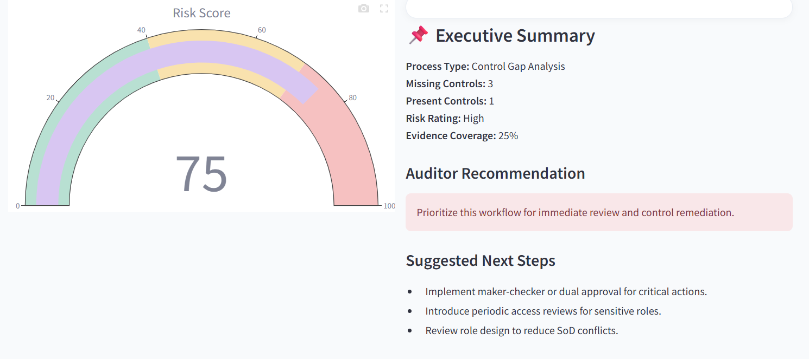

# Audit RAG Assistant  Business Overview & Architecture
##  Business Overview

###  What this tool does

The **Audit RAG Assistant** is an AI-powered decision support tool designed to help organizations evaluate business processes against internal controls and compliance standards.

It analyzes process descriptions, retrieves relevant policy and audit evidence, and identifies **control gaps, risks, and compliance weaknesses** — all presented in a structured, visual dashboard.

Instead of manually reviewing lengthy documents, auditors and risk teams can quickly understand:

— What controls are missing  
— What risks exist  
— What actions are required  

---

###  Target Users

This tool is designed for:

— Internal Audit Teams  
— Risk & Compliance Analysts  
— Finance and Operations Managers  
— IT Governance (ITGC) Teams  
— Audit / Advisory Consultants  

---

### Business Problem Solved

Organizations face several challenges in audit and compliance:

— Manual review of policies and audit reports is time-consuming and error-prone  
— Control validation is inconsistent across teams  
— Identifying risks requires deep domain expertise  
— Audit evidence is fragmented across multiple documents  
— Limited visibility into overall control health and risk exposure  

####  Solution

The Audit RAG Assistant addresses these challenges by:

— Automating control validation using AI  
— Retrieving relevant policy and audit evidence instantly  
— Standardizing control gap identification  
— Providing visual, data-driven insights into risk and compliance  
— Reducing audit effort while improving consistency and coverage  

---

##  Key Features

###  Hybrid Retrieval (RAG)

— Combines semantic search (embeddings) and keyword search (BM25)  
— Retrieves relevant policy statements and audit findings  
— Provides evidence-backed insights with relevance scores  

---

###  Control Gap Detection

— Identifies missing controls such as:
  - Dual Approval (Maker-Checker)  
  - Access Review  
  - Audit Evidence Retention  
  - Segregation of Duties  

— Maps process descriptions to expected control frameworks  

---

###  Interactive Dashboard

— Control coverage visualization (bar chart)  
— Present vs Missing distribution (pie chart)  
— Risk score gauge  
— KPI metrics (controls present, missing, risk level, coverage)  

---

###  Audit Intelligence Layer

— Provides structured insights aligned with audit workflows  
— Highlights key risks and compliance gaps  
— Suggests auditor focus areas and remediation steps  

---

##  Tech Details

— **Frontend:** Streamlit  
— **Retrieval Engine:** Hybrid RAG (Sentence Transformers + BM25)  
— **Embeddings Model:** all-MiniLM-L6-v2  
— **Vector Similarity:** cosine similarity (scikit-learn)  
— **Visualization:** Plotly (interactive charts)  
— **Data Layer:** Text-based policy and audit datasets  

---
##  Architecture Diagram



---
##  Business Value

— Reduces manual audit effort  
— Improves consistency in control evaluation  
— Enables faster risk identification  
— Enhances audit coverage and efficiency  
— Provides explainable, evidence-backed insights  

---

##  Demo

###  Dashboard Overview


---

### Analytics & Risk 


---

### Vizualizations




##  Problem → Solution Mapping

| Problem | Solution |
|--------|---------|
| Manual audit review is time-consuming | Automated RAG-based retrieval |
| Inconsistent control validation | Standardized control detection logic |
| Fragmented audit evidence | Centralized retrieval of policies & findings |
| Limited risk visibility | Interactive dashboard with risk scoring |

##  Evaluation

The system was tested using realistic audit scenarios:

— High-risk workflows with missing controls  
— Partially compliant processes  
— Fully compliant processes  

Evaluation criteria:

— Relevance of retrieved documents  
— Accuracy of control gap detection  
— Clarity of risk insights  
— Consistency across scenarios  

## Key Outcomes

— Reduced manual effort in control validation  
— Faster identification of high-risk processes  
— Improved consistency in audit evaluations  
— Clear, explainable insights for decision-making  

##  Design Decisions

— Hybrid retrieval (Embeddings + BM25) was chosen to balance semantic understanding and keyword precision  

— Rule-based control detection was implemented for explainability and deterministic outputs  

— Streamlit was used for rapid prototyping of an interactive dashboard  

— Plotly was selected for modern, interactive visualizations  

##  Limitations

— Control detection is currently rule-based and not fully context-aware  

— Limited dataset (sample policies and audit findings)  

— No real-time integration with enterprise systems  

— Risk scoring is simplified and not calibrated to industry frameworks  

## Future Enhancements

— Integrate LLM-based reasoning for deeper contextual analysis  

— Add confidence scoring and evaluation metrics  

— Expand dataset with real-world compliance frameworks (SOX, ISO, etc.)  

— Enable report generation (PDF export)  

— Deploy as a cloud-based audit assistant  

##  Extensibility

This project can be extended to:

— Financial compliance monitoring  
— ITGC (IT General Controls) validation  
— Fraud detection workflows  
— Vendor risk management systems  

##  How to Run the Project

### 1. Clone the repository

```bash
git clone https://github.com/YOUR_USERNAME/audit-rag-assistant.git
cd audit-rag-assistant
 
```
### 2. Create a virtual Environment
```bash
python -m venv venv
venv\Scripts\activate

```
### 3. Install Dependencies
```bash
pip install -r requirements.txt
```

### 4. Run the project

```bash
streamlit run app.py
```

### 5. Open in Browser
Streamlit will usually open automatically. If not, go to: http://localhost:8501

### Example Demo Prompt

Paste the following into the input box:
New vendors are onboarded by the procurement team. Approvals are collected through email and stored informally. Users can request access to update vendor bank details, and access is granted by IT without periodic review. No centralized documentation is maintained.
